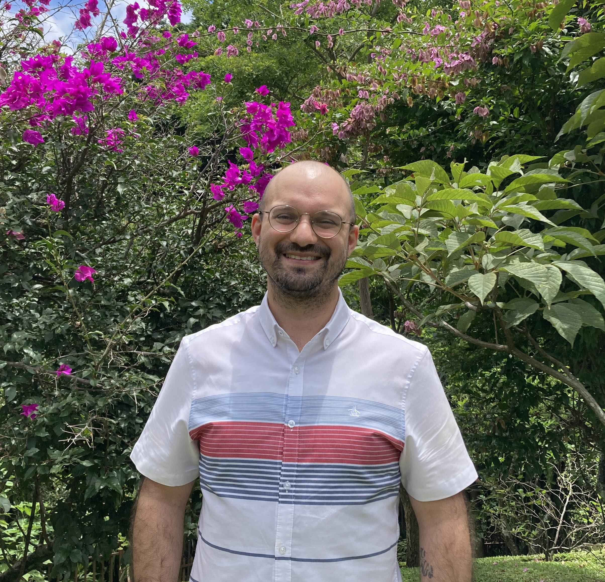

::: {.hero-copy}

Physics | Data Science | AI

# Data-Driven Science 
### For Social & Environmental Good

## Intro to me

Hello there! I am a Lecturer in Physics at Universidad de Costa Rica.
My research and teaching focuses on interdisciplinary AI applications to physics, ecology and fishery science.
Through my lectures I seek to give students practical experience with tools from data science, classical machine learning and deep learning, which find increasing applications in science.

After working on theoretical **quantum computing** during my PhD at the University of Cologne, Germany, my research interests shifted towards more applied and interdisciplinary topics.
My driving question throughout this process has been *how can a mathy guy like me have a positive impact on the world?*

This motivating principle led me to work as a postdoc UC Berkeley's Schmid Center for Data Science & the Environment, and the Department of Enviornmental Science, Policy and Management.
There I led the establishment of a research program at the intersection of data science, machine learning and quantitative ecology.

**Open to work.** I am now excited to transition from academia to the industry as a data scientist or machine learning engineer. I am interested in on-site, hybrid and remote options in Costa Rica, Spain and Italy.

[Get in touch](felipe.montealegremora@gmail.com){.button .button-primary}
[Download CV](files/FelipeMontealegreMora-CV.pdf){.button .button-secondary}

:::

::: {.hero-image}
{fig-alt=""}

Me in a beautiful garden!

:::

## Data science and machine learning toolkit

::: {.skill-grid}

::: {.skill-card}
#### Modeling

Python, PyTorch, Scikit-learn, TensorFlow, Gymnasium, Stable Baselines, Ray/RLlib, Optuna

Reinforcement learning, deep learning, model optimization, time-series modeling, and statistical inference.
:::

::: {.skill-card}
#### Data and scientific computing

NumPy, Pandas, SciPy, xarray, DuckDB, PostgreSQL, GeoPandas, rasterio/rioxarray, ibis, tidyverse

Reproducible pipelines for scientific, geospatial, and observational data.
:::

::: {.skill-card}
#### Production and engineering

Git, pytest, GitHub Actions, GitLab Workflows, Docker, uv, pyenv, SQL

Testing, CI/CD, reproducible environments, databases, and deployment of research software.
:::

::: {.skill-card}
#### Visualization and communication

Matplotlib, Seaborn, Plotly, ggplot2, Plotnine

Clear visual explanations for technical and cross-functional audiences.
:::

::: {.skill-card}
#### Programming foundations

R, C++, Fortran, Matlab

Additional experience developed through statistical, numerical, and scientific-computing projects.
:::

:::

**Selected applications:** built reinforcement-learning systems for fisheries and conservation,
Bayesian wildlife-abundance pipelines, cloud-native geospatial workflows, and ML teaching projects.

### How I use the toolkit

Through my research projects and teaching I've focused on bringing modern software development practices to academic work,
promoting the reproducibility and reusability of my work.
Here I summarize my software and data-related skills I have gained with this approach.

**Reinforcement learning.** 
I've extensively worked in [developing reinforcement learning](https://github.com/boettiger-lab/approx-model-or-approx-soln)
approaches in environmental science contexts such as [fishery management](https://github.com/boettiger-lab/rl4fisheries),
[invasive species management](https://github.com/boettiger-lab/rl4greencrab),
[caribou conservation](https://github.com/boettiger-lab/rl4caribou),
and [dynamical multispecies stabilization](https://github.com/felimomo/LotkaVolterraRL).
Throughout this work I have become experienced with building custom neural network models in **PyTorch**, training feed-forward and recurrent networks and generating CI/CD pipelines for **unit testing**.
I moreover am leading the creation of an [SQL database](https://github.com/boettiger-lab/sql4fisheries) to enhance the reproducibility of our team's fishery RL work.

**Statistical inference, fullstack development.** 
Through my collaboration with Karuk wildlife managers and researchers, 
I have become experienced in statistical inference pipelines in R and Python, 
as well as in the **deployment** of graphical apps through GitHub Actions, 
and in setting up computer vision tools for wildlife monitoring.
In this project I pivoted from creating code internally within my research team 
to developing a backend and frontend for an external stakeholder.
The code repositories are private to protect indigenous data sovereignty, 
however our first paper is published [here](https://onlinelibrary.wiley.com/doi/abs/10.1002/ece3.72355)!
There, we used Bayesian hierarchical modelling and MCMC to infer accurate estimates of the abundance and homerange of elk in the study area
using community observational data.

**Cloud-native geospatial data processing.** 
For a few months I contributed to a [project](https://github.com/boettiger-lab/nasa-topst-env-justice/tree/main) developing a quantitative geospatial approach to environmental justice.
Geospatial data is typically large and thus hosted in the cloud, usually in AWS S3 buckets, 
thus quantitative geospatial analyses are more naturally suited to cloud-native approaches even though they are
commonly implemented locally in academic work.
This project seeked to close this gap, providing tutorials of how to efficiently process geospatial data in 
environmental research contexts in a cloud-native manner.
To maximize the reproducibility of this work, we containerized our pipeline.

**ML in teaching.** In teaching the [*Advanced computational physics*](https://github.com/felimomo/FisicaComputacionalAvanzada) 
lecture at UCR, I have become experienced with a variety of ML algorithms which,
while they were adjacent to my work, had not shown up in my research projects.
For example I have become experienced in setting up practical workshops on using SciKit-Learn, SciKit-Optimize and PyTorch
to run ML classification tasks, logistic regression, ridge regression, support vector machine optimization,
k-means clustering, and semi-definite programming optimization.

**Data visualization.** Given that I am a mathy guy who works with both physicists, ecologists, wildlife managers and citizen science data, 
it has been crucial for me to provide informative and actionable data visualizations every step of the way in my collaborations.
I believe that data visualization is the ground on which one can build successful, cross-functional collaborations.

**Additional tools.** I also use agentic AI tools to support software development:
this website was deployed with the Copilot CLI, which I have also used to
[debug and optimize](https://github.com/felimomo/LotkaVolterraRL/agents?q=is%3Aclosed+author%3A%40me)
an ongoing reinforcement learning project.

## Research {#research}

My research line uses a variety of **deep learning**, **data science** and **applied statistics** to address hard scientific questions.

::: {.research-card}
01

### Reinforcement learning

to guide decision-making in complex ecological problems like
[fishery harvest quotas](https://github.com/boettiger-lab/rl4fisheries),
optimal resource use in [invasive species management](https://github.com/boettiger-lab/rl4greencrab) and
and [multi-species food-web stabilization](https://github.com/felimomo/LotkaVolterraRL).
:::

::: {.research-card}
02

### Statistical inference

of [wildlife abundance](https://doi.org/10.1002/ece3.72355) from limited and noisy observations.
:::

::: {.research-card}
03

### AI-enhanced ecology

[How can](https://ecoviz-ai.github.io) ecologists effectively and safely use AI-powered tools to provide data-driven support on conservation decisions?
Particularly, this project addresses the question in the context of *indigenous data sovereignty*.
:::

::: {.research-card}
04

### Clifford group representations

The Clifford group is an immensely important mathematical object in quantum computing. 
Understanding its representation theory can unlock applications across the board, from quantum device characterization to novel quantum protocols.
In this project I have led the development of several approaches to characterize this representation theory.
:::

I'm also dabbling in other projects like on statistical inference for heavy ion collision experiments with my close friend and collaborator Oscar García.
Similarly, I occasionally enjoy contributing to the open source ecosystem on, e.g., [MyST](https://github.com/felimomo/MyST-RefSort) or improving [the experience](https://github.com/felimomo/FormateadorListasEmatricula) of other lecturers in generating useful class list documents.

## Publications {#publications}

Selected publications and works in progress. For a complete list, please visit my [Google Scholar](https://scholar.google.com/citations?user=4xcoxEcAAAAJ&hl=en) profile.

::: {.publication-list}
**F. Montealegre-Mora**, C. Cahill, C. Walters, C. Boettiger. (2025) Using machine learning to inform harvest control rule design in complex fishery settings. *Fish and Fisheries.*  

T. Connor, **F. Montealegre-Mora**, B.J. Saxon, J. Camarena, D. Sarna-Wijcicki, M. de Bruyn, K.L. Calhoun, C.C. Martinez, E. Tripp. (2025). Indigenous Knowledge and Community‐Derived Counts Produce Robust Wildlife Population Estimates: Roosevelt Elk in Karuk Aboriginal Territory. *Ecology & Evolution.*

**F. Montealegre-Mora**, D. Gross. (2025) Duality theory for Clifford tensor powers. *J. Mathematical Physics.*

**F. Montealegre-Mora**, M. Lapeyrolerie, M. Chapman, A.G. Keller, C. Boettiger. (2023) Pretty darn good control: when are approximate solutions better than approximate models. *Bulletin of Mathematical Biology*.

D. Ellis-Soto et al. (incl. **Montealegre-Mora** in core organizing team). (2026) Aligning biodiversity AI with social, historical, and governance dimensions is critical for conservation science. *Submitted to One Earth.*
:::

## Teaching {#teaching}

::: {.teaching-highlight}
### Courses

**Advanced computational physics** / II-2026 /
Numerical spectral analysis for PDEs, Optimization algorithms, Machine learning and deep learning.
For advanced physics undergrads

**Algorithmic textual analysis** / II-2026 /
Introduction to statistical and deep learning approaches for textual and sentiment analysis.
For professional social scientists.

**Tropical Fishery Science and Management** / II-2026 /
Co-lecturer teaching stock assessment statistical modelling and ML methods in fishery science.
For grad students in the [GIACT](https://www.sep.ucr.ac.cr/posgrado-gestion-areas-costeras-maestria) master's degree.

**General Physics I & II** / II-2026 /
Lectures for first and second year engineering undergrads covering introductory mechanics, fluid dynamics, wave mechanics, thermodynamics and electrostatics.
:::

## Music {#music}

Besides my academic work, I love playing music! Here I'll post songs from several of my musical projects.
